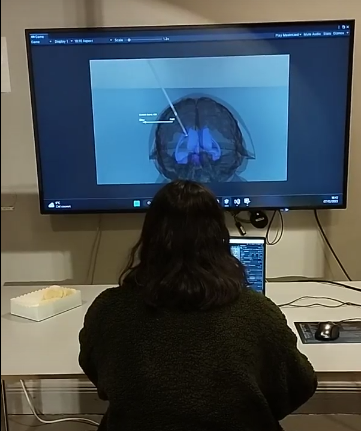
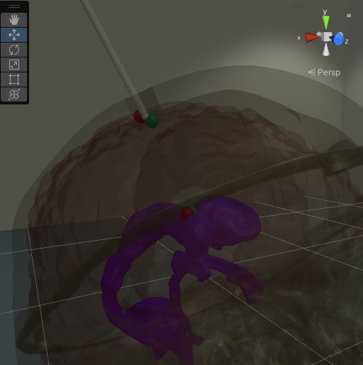

# MOCAP PROJECT
This project has been realised in the scope of the course Advanced Projects in Interactive Media Technology, HT2022, KTH.
The work involves the work of 4 KTH students : Marcus Holmberg, Måns Nyman, Léa Prémont, Mahmoud Sherzad.

## Requirements
This project uses virtual reality (VR). To use the VR features, you will need a HTC Vive Pro connected to a VR-ready computer. 
We recommend that you ensure that your space is large enough to avoid any risk of injury during the manipulation in VR.

## Additional files
The following files are large files that were not uploaded to the GitHub due to GitHub size limit. 

 -  Brain asset, [download here](https://drive.google.com/drive/folders/16Udq9WilMrpLHSWjlSX2FE2UV7RKhFIf?usp=sharing) 
 -  Build files, [download here](https://drive.google.com/drive/folders/1FRYA5DsCPTDdeCjxJsia8MhZr37weHdD?usp=sharing) 

 In the build files, Desktop.zip contains the desktop version and VR.zip contains the VR version of our project. Note that there is currently
 no way of switching which recording is being played in the builds. Also note that there is no way to see information such as the annotation time
 in the build version, as we used the Unity console logs for displaying such information which is not visible in a compiled build. The build files 
 come preconfigured so that the desktop version is playing recording 6 and the VR version is playing recording 5.

## Install and run the project
In order to reproduce the experiment, follow these steps:
**Initial set up:**
 - Check that you have Unity version 2021.3.3f1 installed on your computer. If not, get it [here](https://unity.com/releases/editor/archive#download-archive-2021).
 - Download the repository.
 - Download the Brain asset (see Additionnal files) and place it under the  Assets>Prefabs folder.
 - Launch the Unity project.  
 
**For the desktop version:**
 - Go to the Scenes folder, and open the DesktopScene scene. 
 - Go to the Scripts folder. Open Simulator.cs. On line 35, change the file name according to the number of the recording you want to play. For recording catheter006, the path should be *"Assets/Recordings/catheter006.txt"*. Save it.
 - Run the scene.
 
**For the VR version:**
 - Check that you have SteamVR installed on your computer. Launch SteamVR. Check that the headset and controllers are well connected.
 - Go to the Scenes folder, and open the VRScene scene. 
 - Go to the Scripts folder. Open VRSimulator.cs. On line 41, change the file name according to the number of the recording you want to play. For recording catheter006, the path should be *"Assets/Recordings/catheter006.txt"*. Save it.
 - Run the scene. A ray should go out of your right hand. If not, swap your controllers.

More detailed instructions containing control schemes as well as additional information on running the project can be found in [this document] (https://docs.google.com/document/d/1GC-xSK3XdPcphokTiqTdBISnV-ebJ-0fEk4kww-Skn0/edit?usp=sharing).

 ## Illustrations

Here is our setup for the desktop version. The user has has mouse and a keyboard, and looks at the big screen in front of him/her. 

The above picture shows how the skull, brain and ventricules look when the transparency is toggled. The markers are placed and visible as four small spheres. 
